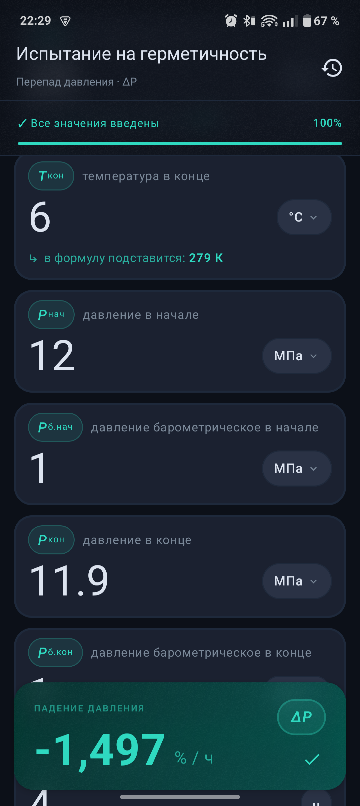
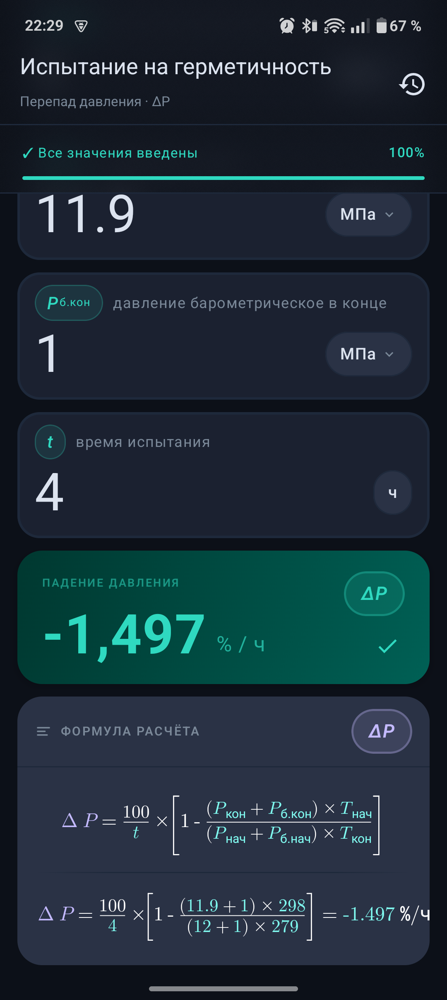
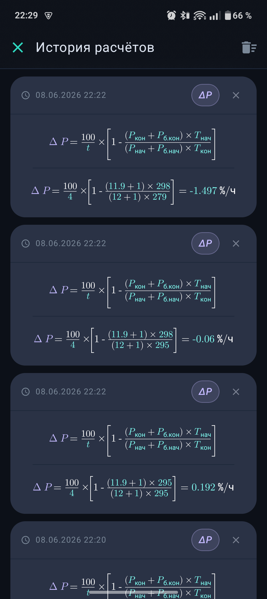

<p align="center">
  
</p>

<h1 align="center">Delta</h1>

<p align="center">
  Калькулятор падения давления для испытаний на герметичность
</p>

---

Delta — Android-приложение для расчёта падения давления (ΔP) по результатам испытаний трубопроводов и оборудования на герметичность. Подставляет введённые значения в формулу, отображает полный расчёт в LaTeX-нотации и сохраняет историю вычислений.

## Скриншоты

| Ввод параметров | Результат и формула | История расчётов |
|---|---|---|
|  |  |  |

## Формула

$$\Delta P = \frac{100}{t} \times \left[1 - \frac{(P_\text{кон} + P_\text{б.кон}) \times T_\text{нач}}{(P_\text{нач} + P_\text{б.нач}) \times T_\text{кон}}\right]$$

| Параметр | Описание | Единицы |
|---|---|---|
| `t` | время испытания | ч / мин / с |
| `P_нач` | давление манометрическое в начале | МПа / кгс·см² |
| `P_кон` | давление манометрическое в конце | МПа / кгс·см² |
| `P_б.нач` | давление барометрическое в начале | МПа / кгс·см² |
| `P_б.кон` | давление барометрическое в конце | МПа / кгс·см² |
| `T_нач` | температура в начале | °C / К |
| `T_кон` | температура в конце | °C / К |
| `ΔP` | падение давления | %/ч |

## Возможности

- **Расчёт ΔP** — мгновенный пересчёт при вводе каждого значения
- **LaTeX-формула** — отображает абстрактную и подставленную формулу с результатом
- **Выбор единиц** — переключение единиц давления и температуры для каждого поля
- **Индикатор заполнения** — прогресс-бар показывает, все ли значения введены
- **История расчётов** — все вычисления сохраняются локально; тап на запись восстанавливает значения в калькуляторе
- **Тёмная тема** — интерфейс адаптирован для полевых условий

## Стек технологий

- **Kotlin** + **Jetpack Compose**
- **Decompose** — навигация и управление состоянием
- **SQLDelight** — локальное хранение истории
- **LaTeX Renderer** — рендеринг математических формул

## Требования

- Android 6.0 (API 23) и выше

## Сборка

```bash
./gradlew assembleDebug
```